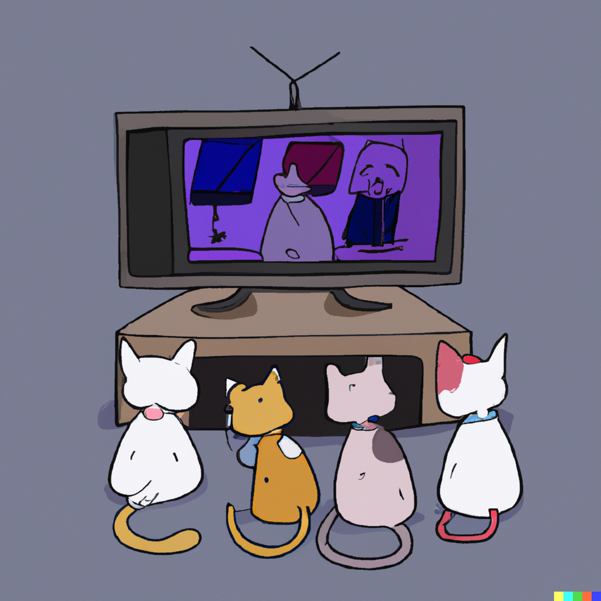

# Cats Love YouTube

## Project Setup

- `npm install`
- `node ./server/server.js`

---

# Maintainers

This project is maintained by [Pnlpal](https://github.com/pnlpal), and initially created by [River](https://github.com/revir) with some assistance from [Lybron](https://github.com/lybron).

---

# Contribution Guidelines

Thank you for your interest in contributing to our project! All contributions are welcome, from code to documentation to design. Please read eh following guidelines before submitting a contribution.

## Table of Contents

1. [Code of Conduct](#code-of-conduct)
2. [Getting Started](#getting-started)
3. [How to Submit Changes](#how-to-submit-changes)
4. [Style Guidelines & Naming Conventions](#style-guidelines--naming-conventions)
5. [Where to Ask for Help](#where-to-ask-for-help)

## Code of Conduct

All contributors are expected to adhere to the project's Code of Conduct.

We welcome developers from all walks of life, with different backgrounds, and levels of experience.

We reserve the the right to remove, edit, or reject comments, commits, code, wiki edits, issues, and other contributions that are not aligned with the Code of Conduct, or to ban temporarily or permanently any contributor for behaviors that we deem inappropriate, threatening, offensive, or harmful.

## Getting Started

1. **Fork the Repository**: To contribute, fork the project repository, make your changes in a new branch, and submit a pull request.

2. **Issues**: Start by looking at the current open issues. This could be a good place for newcomers to start. Look for issues labeled `good first issue` or `help wanted`.

3. **New Ideas/Features**: If you want to add a new feature or idea, please open a new issue first. This lets the community discuss the feature before significant work is done.

## How to Submit Changes

1. **Pull Requests**: Please ensure you are working off the latest version of the main branch. When you're ready to submit your changes, create a new pull request from your forked repository's branch to the main project repository.

2. **Commit Message Format**: Use concise and clear commit messages. Begin the message with a single short (less than 50 character) line summarizing the changes, followed by a blank line and then a more thorough description if necessary.

3. **Tests**: Ensure that your code includes unit tests to verify the functionality of your changes and that all tests pass before submitting.

4. **Documentation**: If your changes involve functionality, make sure they are reflected in the project's documentation.

5. **Code Review**: Be ready for a code review and engage in the process. Address any comments or feedback provided.

## Style Guidelines & Naming Conventions

1. **Coding Style**: Follow the coding style used throughout the project.

2. **Comments**: Use comments to explain the why, not the what. They should provide context and be meaningful.

3. **Naming**: Naming should be descriptive and not abbreviate unnecessarily. Functions, variables, and files should be named in a way that explains their purpose.

4. **File Organization**: Do not mix functionalities in one file. If a function or class becomes too big, consider breaking it down.

## Where to Ask for Help

1. **Questions**: If you have questions regarding the project or your contributions, open an issue labeled `question`.

2. **Community Chat**: Join our community chat on Discord to discuss ideas, ask questions, or seek guidance.

---

**Thank you for being a part of our community and for your contributions!**
